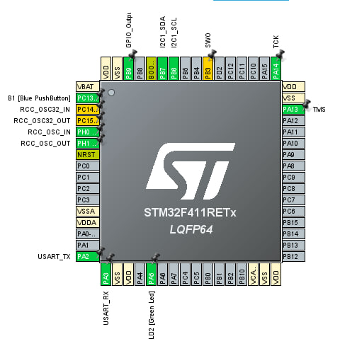
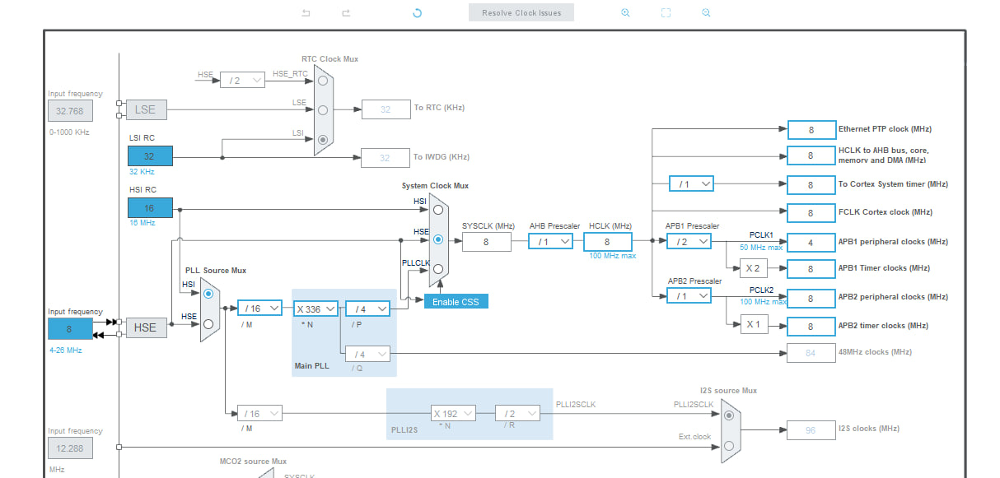
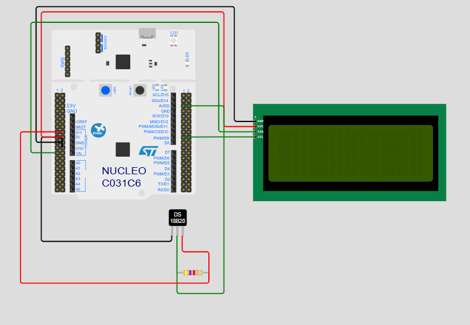

<video src="images/demonstration_video.mp4" width="400" controls>
    Your browser does not support the video tag.
</video>

# Temperature Display on LCD 2004 I2C Using DS18B20 and NUCLEO-F411RE

This project demonstrates how to read temperature data from a DS18B20 sensor and display it on an LCD 2004 using the I2C protocol. The project is implemented on the **NUCLEO-F411RE** microcontroller.

---

## 💜 Table of Contents

- [Introduction](#introduction)
- [Features](#features)
- [Hardware Components](#hardware-components)
- [Circuit Diagram](#circuit-diagram)
- [Software Description](#software-description)
- [Getting Started](#getting-started)
- [Future Improvements](#future-improvements)
- [License](#license)

---

## 🖍 Introduction

The goal of this project is to measure ambient temperature using the DS18B20 digital temperature sensor and display it on an LCD 2004. The system uses the I2C interface for LCD communication and a one-wire protocol for the DS18B20 sensor.

---

## 🌟 Features

- **Temperature Measurement**: Reads accurate temperature data using the DS18B20 sensor.
- **LCD Display**: Displays temperature in Celsius on an LCD 2004 screen via I2C.
- **Real-Time Updates**: Continuously updates the temperature display in real time.

---

## 💪 Hardware Components

1. **NUCLEO-F411RE** (STM32 microcontroller board)
2. **DS18B20 Temperature Sensor**
3. **LCD 2004** with I2C backpack
4. **Pull-Up Resistor** (4.7kΩ) for DS18B20 one-wire data line
5. **Jumper Wires**
6. **Breadboard**

---

## 🔍 Circuit Diagram

### Connections:

1. **DS18B20**:

   - `VCC`: 3.3V (NUCLEO)
   - `GND`: GND (NUCLEO)
   - `DQ`: Connect to a GPIO pin (e.g., `PC7`) with a 4.7kΩ pull-up resistor to 3.3V.

2. **LCD 2004 with I2C Backpack**:

   - `SDA`: Connect to `PB7` (I2C1 SDA on NUCLEO-F411RE).
   - `SCL`: Connect to `PB6` (I2C1 SCL on NUCLEO-F411RE).
   - `VCC`: 5V (NUCLEO)
   - `GND`: GND (NUCLEO)

---

## 💻 Software Description

The project is developed using **STM32CubeIDE** with HAL libraries.

### Key Functionalities:

1. **DS18B20 Sensor**:

   - Configured to operate using a one-wire protocol.
   - Reads temperature and converts it to Celsius format.

2. **LCD 2004 Display**:

   - Configured to communicate over the I2C bus.

3. **Main Loop**:

   - Continuously reads temperature from the DS18B20.
   - Updates the LCD display in real time.

---

## 🚀 Getting Started

### 1. Clone the Repository

```bash
git clone https://github.com/job-space/NUCLEO-LCD-DS18B20.git
cd NUCLEO-LCD-DS18B20  
```

### 2. Configure STM32CubeIDE Project

1. Open STM32CubeIDE and import the project.
2. Enable the following peripherals in **CubeMX**:
   - GPIO for DS18B20 data line.
   - I2C1 for LCD communication.
3. Generate code and add the DS18B20 driver and LCD I2C driver files.

### 3. Program the Microcontroller

1. Connect your NUCLEO-F411RE board to the computer using a micro-USB cable.
2. Build and flash the project onto the board.

---

## 🔐 Commands and Functionality

1. **Temperature Measurement**: The DS18B20 sensor measures the temperature in real time.
2. **LCD Display**: The temperature is displayed in Celsius on the LCD 2004.

---

## Developers
 
[y.kovalchuk](https://github.com/job-space)

---

## License

This project is distributed under the MIT License.

---


